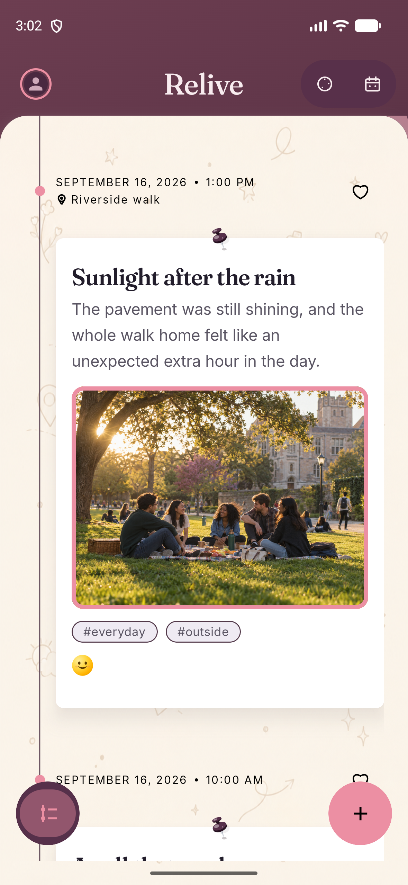
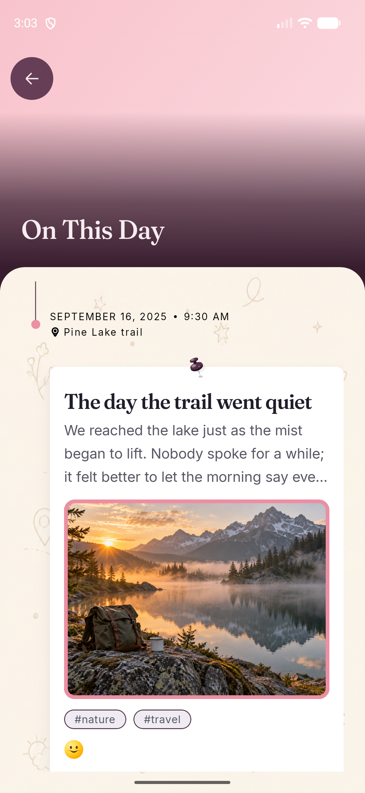
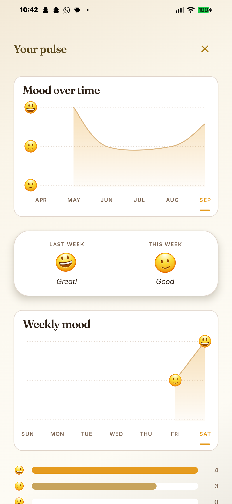
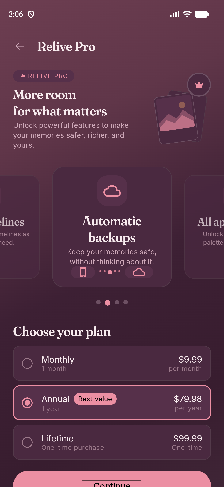
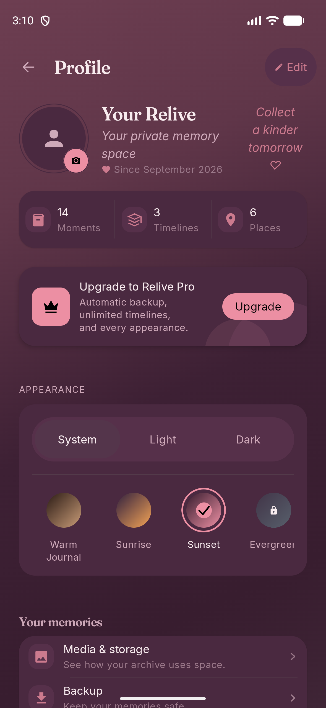
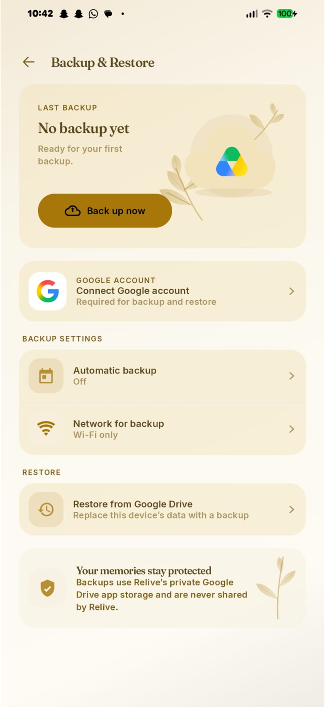
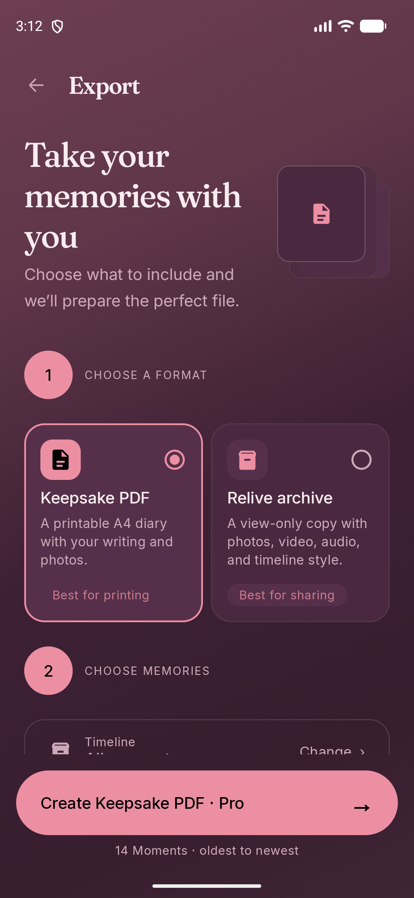

# Relive

**Your private timeline for the moments you want to remember.**

[relivemoments.app](https://relivemoments.app) · [Privacy Policy](https://relivemoments.app/privacy) · [Terms of Service](https://relivemoments.app/terms)

Relive turns everyday thoughts, photos, videos, audio, places, tags, and feelings into a personal timeline made to be revisited. It brings the context around a memory into one warm, scrollable archive—without followers, a public feed, or the pressure to perform.

Capture now. Let time organize it. Rediscover it later.

<p align="center">
  <a href="shipaton/screenshots/01-timeline.png"></a>
  <a href="shipaton/screenshots/03-rediscover.png"></a>
  <a href="shipaton/screenshots/04-mood-insights.png"></a>
  <a href="shipaton/screenshots/06-relive-pro.png"></a>
</p>
<p align="center"><sub>Timeline · Rediscover · Mood Insights · Relive Pro</sub></p>

## Why Relive?

Most tools are good at storing pieces of a life. Camera rolls hold media, notes hold thoughts, and cloud drives hold files—but the story around a small moment is easily separated or buried.

Relive is designed around **returning to your memories**, not collecting more content. A Moment keeps the writing and media together with its time, place, tags, feeling, favourite state, and timeline memberships. The chronological card-and-rail presentation turns those Moments into a personal narrative rather than another folder to maintain.

## The product idea

- **Capture without friction.** Save a thought, one or more photos, video, or audio without turning memory keeping into work.
- **Let time organize naturally.** Every Moment belongs in the chronological archive and can also appear in multiple custom timelines without duplication.
- **Rediscover, don't just archive.** On This Day, From Your Past, Favourites, and All Photos create natural ways back into the archive.
- **Private by design.** Relive is personal rather than performative: no account system, social graph, public feed, or application backend.
- **Keep ownership practical.** Optional backup, portable archives, and Keepsake PDFs prevent memories from being trapped inside one screen or device.

## The Relive experience

`Capture → Moment → Timeline → Organize → Rediscover → Relive`

### Capture

Create a Moment from text, photos, video, audio, a readable place, tags, and an optional feeling. Media is copied into app-owned storage before the Moment references it.

### Timeline

The signature newest-first feed presents Moments as editorial cards along a continuous timeline rail. Cards retain their date and time, media, place, tags, favourite state, and surrounding context.

### Organize

Create custom timelines with their own cover and appearance, place one Moment in several timelines without copying it, and return through search, favourites, All Photos, or the Rediscover collections.

### Rediscover

Rediscover is the reason the archive exists. On This Day resurfaces the same calendar date from earlier years; From Your Past brings back older Moments; Favourites keeps personally important memories close.

### Reflect and personalize

Mood Insights is a lightweight reflection layer computed locally from Moment dates and optional saved feelings; mood scores use only Moments with a feeling. It summarizes the current and previous week, a seven-day view, six calendar months, the last 28 days, and a Moment streak. It helps reveal patterns in the saved archive; it is not medical or psychological analysis. Relive also includes light, dark, and system appearance modes, multiple palettes, and timeline wallpapers.

## Private by design

The archive is local-first. Memories remain in Relive's private app storage unless the user explicitly chooses to enable backup or create an export. Network services are limited to user-enabled Google Drive backup and RevenueCat purchase/entitlement operations; Relive has no application backend or third-party analytics SDK.

### Google Drive backup

Android backup is optional and user-authorized. Relive requests only `https://www.googleapis.com/auth/drive.appdata`, stores versioned backup bundles in the hidden app-specific Drive folder, and does not persist access or refresh tokens. Backup and transactional restore preserve Moment data, relationships, and managed media. See [Google Drive setup](docs/GOOGLE_DRIVE_SETUP.md).

### Portable Relive archive

A `.relive` export contains a versioned manifest, Moments, custom timelines, memberships, timeline appearance, media, byte counts, and SHA-256 integrity hashes. Relive validates archive paths, entry limits, metadata relationships, and checksums before opening it as a read-only archive.

### Keepsake PDF

Keepsake export creates a human-readable, printable A4 memory diary with writing and photos. Video and audio remain part of the portable archive; they are not presented as playable media inside the PDF.

Exported files are intentionally unencrypted and leave App Lock, so Relive discloses that before creation and uses user-controlled system save/share destinations.

## Relive Pro — powered by RevenueCat

Relive uses the RevenueCat Purchases KMP SDK as the source of truth for the `relive_pro` entitlement. The app loads store offerings and localized prices, supports Monthly, Annual, and Lifetime products, submits purchases through RevenueCat, restores purchases, refreshes customer information, and unlocks Pro only when RevenueCat reports an active entitlement.

Pro gates are implemented in shared policy code: unlimited custom timelines, the complete palette and wallpaper collections, automatic backup scheduling, and export creation. The Shipaton `demoDebug` build uses RevenueCat Test Store so judges can exercise the real lifecycle:

`Test Store purchase → RevenueCat customer info → relive_pro entitlement → Pro features unlock`

There is no local "pretend Pro" switch. Public SDK keys are supplied at build time; RevenueCat secret keys are rejected and never belong in the client.

## What makes Relive different

| Tool | Primarily designed for |
| --- | --- |
| Camera roll | Storing media |
| Notes | Capturing written thoughts |
| Cloud storage | Keeping files |
| Social platforms | Sharing with other people |
| **Relive** | Building a private memory timeline for your future self |

## Relive in action

<table>
  <tr>
    <td align="center"><a href="shipaton/screenshots/01-timeline.png"></a><br><sub>Timeline</sub></td>
    <td align="center"><a href="shipaton/screenshots/03-rediscover.png"></a><br><sub>Rediscover</sub></td>
    <td align="center"><a href="shipaton/screenshots/04-mood-insights.png"></a><br><sub>Mood Insights</sub></td>
  </tr>
  <tr>
    <td align="center"><a href="shipaton/screenshots/07-profile.png"></a><br><sub>Profile & appearance</sub></td>
    <td align="center"><a href="shipaton/screenshots/08-backup.png"></a><br><sub>Backup & restore</sub></td>
    <td align="center"><a href="shipaton/screenshots/09-export.png"></a><br><sub>Export</sub></td>
  </tr>
</table>

All screenshots show the real Android `demo` flavor with intentionally seeded, project-owned showcase data.

## Built with

- Kotlin 2.4.10 and Kotlin Multiplatform
- Compose Multiplatform 1.11.1
- Android and iOS targets with shared domain, data, presentation, and UI code
- SQLDelight 2.3.2 over SQLite with verified migrations and foreign keys
- RevenueCat Purchases KMP
- Android Credential Manager, Google Identity Services, and the Google Drive API
- CameraX and Media3 at the Android platform boundary

## Architecture

Dependencies point inward and platform APIs stay behind shared interfaces:

```text
androidApp/ + iosApp/
          ↓
shared presentation and Compose UI
          ↓
       domain
          ↑
shared data and repositories
          ↓
SQLDelight + app-owned media storage

Platform integrations: RevenueCat · Google Drive · camera · media playback · export
```

The process-lifetime app container owns repositories and platform integrations, while shared view models depend on interfaces. Read the full [architecture](docs/ARCHITECTURE.md) and [decision record](docs/DECISIONS.md).

The repository's source-of-truth documents are the [product specification](docs/PRODUCT_SPEC.md), [design system](docs/DESIGN_SYSTEM.md), [roadmap](docs/ROADMAP.md), and [testing strategy](docs/TESTING.md). Contributor operating rules live in [AGENTS.md](AGENTS.md).

## Build variants

| Variant | Purpose | Demo data | RevenueCat configuration |
| --- | --- | --- | --- |
| `demoDebug` | Shipaton judge build | Idempotent generic archive | Test Store supported |
| `friendsReleaseCandidate` | Relive Release Candidate APK for direct testing | None | Test Store supported; debuggable and debug-signed |
| `productionDebug` / `productionRelease` | Normal product configuration | None | Production public SDK key only; Test Store rejected |

The demo bootstrap writes through the same repositories and media store as a real Moment. It is compiled only into the `demo` flavor; `friends` and `production` compile a no-op bootstrap and package no demo assets.

### Demo data transparency

The judge archive is generic, uses original project-owned media, and is seeded idempotently so time-dependent features are useful immediately. Its code and assets exist only in the `demo` source set; the clean friends and production variants never receive those Moments.

## Shipaton judge quick start

1. Clone the repository and meet the requirements below.
2. Add a RevenueCat Test Store public SDK key to untracked local configuration. The public legal URLs are included by default.
3. Build and install `demoDebug`.
4. Launch the app; the showcase archive is seeded once on first launch.
5. Open **Relive Pro** to test purchase and restore through RevenueCat Test Store.
6. Explore **On This Day**, **From Your Past**, **Mood Insights**, custom timelines, backup, and export.
7. Create a new Moment to verify that the judge build uses normal persistent storage.

## Run locally

### Requirements

- JDK 17 or newer
- Android Studio with Android SDK 36
- Android device or emulator running API 24 or newer
- Gradle 9.1 via the checked-in wrapper
- macOS with Xcode for the iOS target

### Clone

```bash
git clone https://github.com/Vaibhav200303/relive.git
cd relive
```

On Windows, replace `./gradlew` below with `gradlew.bat`.

### Configure

Values can be supplied as Gradle properties, environment variables, or entries in untracked `local.properties`:

| Name | Required for |
| --- | --- |
| `RELIVE_REVENUECAT_DEMO_ANDROID_PUBLIC_API_KEY` | Demo Test Store purchases (`test_...`) |
| `RELIVE_REVENUECAT_FRIENDS_ANDROID_PUBLIC_API_KEY` | Friends Test Store purchases (`test_...`) |
| `RELIVE_REVENUECAT_PRODUCTION_ANDROID_PUBLIC_API_KEY` | Production store purchases (`goog_...`) |
| `RELIVE_GOOGLE_WEB_CLIENT_ID` | Android Google Drive account authorization |
| `RELIVE_TERMS_OF_SERVICE_URL` | Optional override for `https://relivemoments.app/terms` |
| `RELIVE_PRIVACY_POLICY_URL` | Optional override for `https://relivemoments.app/privacy` |
| `RELIVE_SUPPORT_EMAIL` | Help & Feedback email action |

Release signing is optional for local debug/judge builds. Production release signing can be supplied with `RELIVE_RELEASE_STORE_FILE`, `RELIVE_RELEASE_STORE_PASSWORD`, `RELIVE_RELEASE_KEY_ALIAS`, and `RELIVE_RELEASE_KEY_PASSWORD`; signing material must remain outside version control.

The app builds without service credentials, but purchase and Drive actions remain unavailable until their public configuration is supplied. Never add RevenueCat secret keys, OAuth client secrets, service-account files, signing files, or passwords to the repository.

### Build and install the judge app

```bash
./gradlew :androidApp:assembleDemoDebug
./gradlew :androidApp:installDemoDebug
```

The APK is written to `androidApp/build/outputs/apk/demo/debug/`.

### Other Android artifacts

```bash
./gradlew :androidApp:assembleFriendsReleaseCandidate
./gradlew :androidApp:assembleProductionDebug
```

For iOS, open `iosApp/iosApp.xcodeproj` in Xcode after configuring an Apple team and bundle identifier.

## Quality & testing

The repository includes domain, presentation, persistence, migration, backup/restore, export/archive, entitlement-policy, and demo-seed tests. The submission verification path is:

```bash
./gradlew \
  :shared:testAndroidHostTest \
  :shared:verifySqlDelightMigration \
  :androidApp:testDemoDebugUnitTest \
  :androidApp:testFriendsDebugUnitTest \
  :androidApp:testProductionDebugUnitTest \
  :androidApp:lint \
  :androidApp:assembleDemoDebug \
  :androidApp:assembleFriendsReleaseCandidate \
  :androidApp:assembleProductionDebug
```

This complete command passed on Windows on 2026-09-16, including Android lint, SQLDelight migration verification, all three flavor unit-test targets, and the demo, friends, and production artifacts.

iOS simulator tests require macOS:

```bash
./gradlew :shared:iosSimulatorArm64Test
```

Manual platform and release checks are tracked in [Testing](docs/TESTING.md) and [Release](docs/RELEASE.md).

## Security & privacy engineering

- RevenueCat client configuration accepts recognized public key prefixes, rejects secret `sk_...` values, and prevents Test Store keys from initializing production.
- API keys, OAuth deployment values, signing credentials, `.env` files, `local.properties`, service-account files, and keystores are ignored by Git.
- Android OS backup is disabled for the private local archive.
- Google Drive uses the narrow `drive.appdata` scope and app-specific storage.
- Backup restore and portable archive readers validate paths, duplicates, entry limits, relationships, and integrity before accepting data.
- Relive uses app-owned storage and requests no broad storage or background-location permission.

## Project structure

```text
Relive/
├── androidApp/   Android entry point, flavors, Drive integration, and judge seed
├── shared/       Shared domain, data, presentation, Compose UI, and tests
├── iosApp/       iOS host application and platform resources
├── docs/         Product, architecture, design, testing, release, and ADRs
├── shipaton/     Real judge-facing product screenshots
└── gradle/       Version catalog and Gradle wrapper configuration
```

## Why I built Relive

I wanted a place where small moments could live without becoming social posts or disappearing into a camera roll. Building Relive became an exploration of what a personal memory product could feel like when it is designed around rediscovery rather than engagement.

## Shipaton 2026

Relive is a student-built, open-source submission to the **RevenueCat Shipaton 2026 Next Gen Award**. The Android demo build includes isolated showcase data for time-dependent features and a real RevenueCat Test Store integration; it does not replace the production persistence, purchase, backup, or export paths with mocks.

## License

Relive is available under the [MIT License](LICENSE). Bundled fonts retain their own licenses in [`shared/licenses`](shared/licenses).
